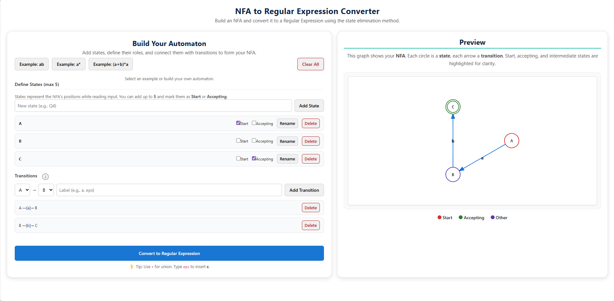
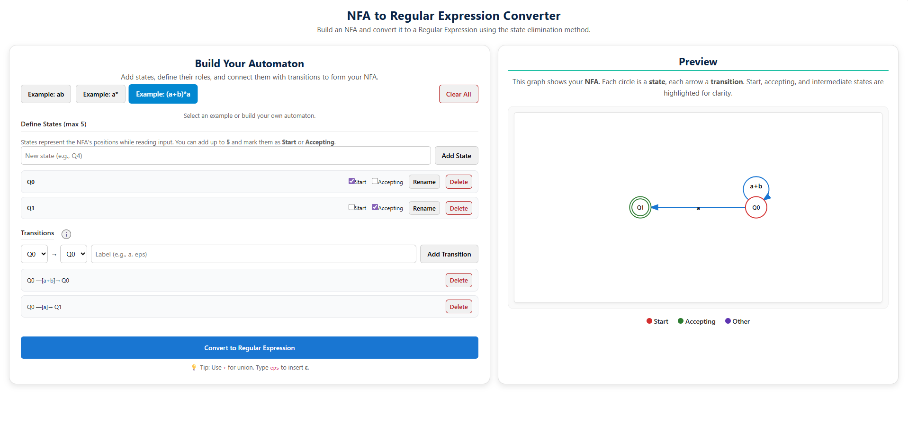
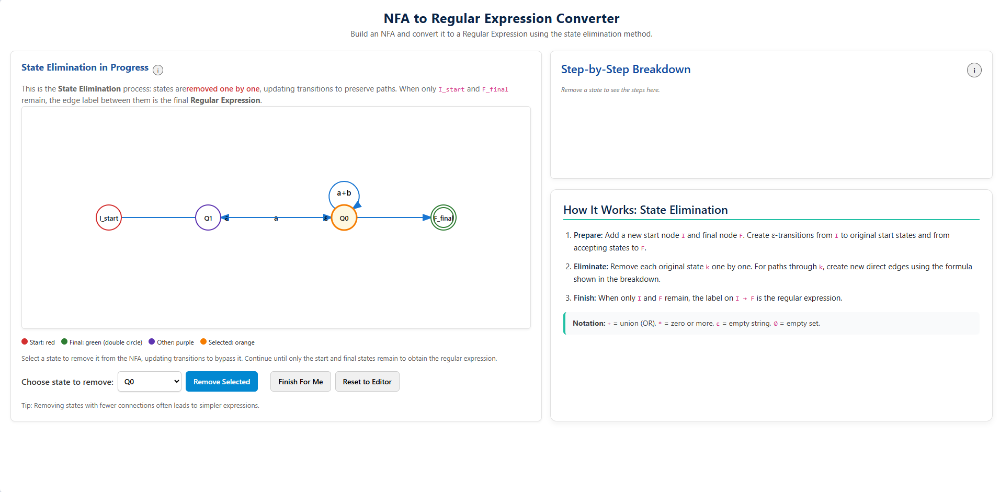
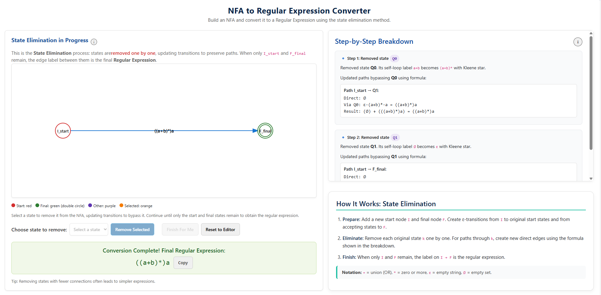

Start by exploring the fundamental concepts by interacting with the basic operations 
available in the tool.

Select any basic operation to view its corresponding 
<strong>NFA graphical representation</strong> along with the equivalent 
<strong>Regular Expression</strong>.

<h4>Step 1 – Define States</h4>

Begin by creating or confirming the <strong>states</strong> of your NFA.  
Mark one state as the <strong>Start</strong> state and at least one as the 
<strong>Accepting</strong> state.

<h4>Step 2 – Configure NFA</h4>

Once the states are set, review the automatically generated transitions.  
When everything is ready, click the <strong>Convert to Regular Expression</strong> 
button to begin the process.

<h4>Step 3 – State Elimination</h4>

The tool will now guide you through <strong>state elimination</strong>.  
Intermediate states are removed one by one while updating transitions to 
preserve possible paths.  
Continue this until only the Start and Final states remain.

<ol>
  <li>Select a state to remove.</li>
  <li>Click <strong>Remove Selected</strong>.</li>
  <li>Repeat until just the initial and final nodes remain.</li>
</ol>

💡 <em>Tip:</em> Start by removing states with fewer transitions 
to simplify the resulting expression.

<h4>Step 4 – Final Regular Expression</h4>

Once all intermediate states are removed, the edge between the Start and Final 
nodes will represent the complete <strong>Regular Expression</strong> corresponding 
to the original NFA.

✅ <b>Conversion Complete!</b>

