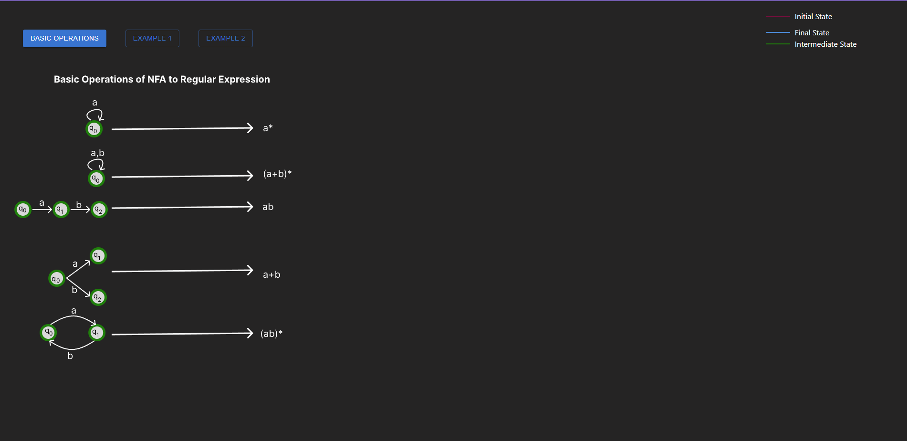
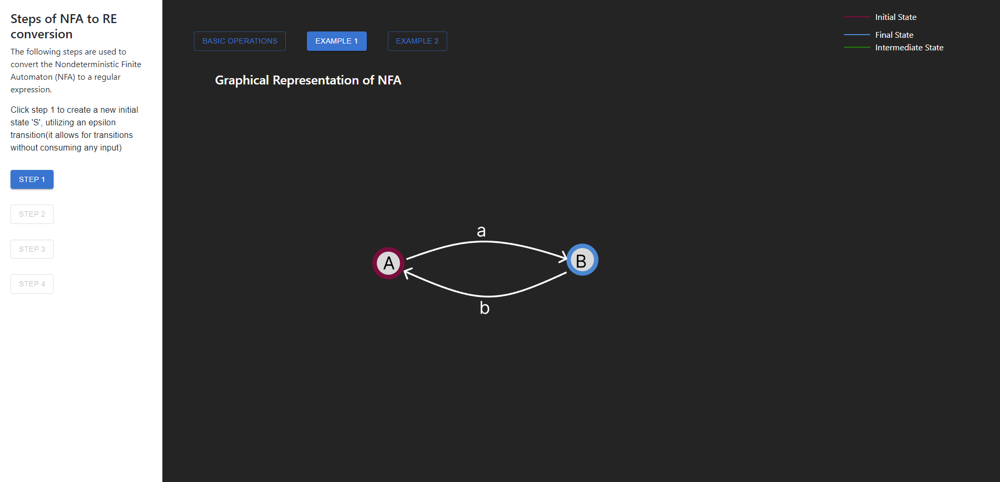
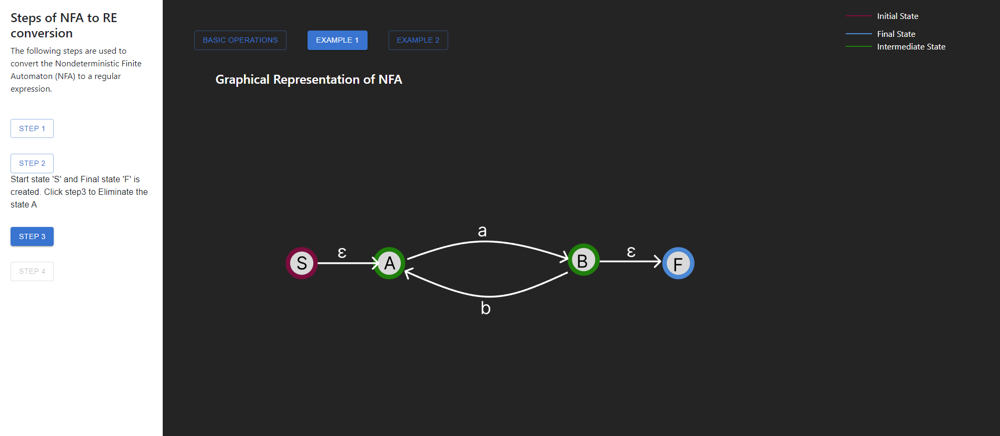

<h3>Procedure</h3>

Start by exploring the fundamental concepts through  interacting with  basic operations

Select any basic operation to view its corresponding 
<strong>NFA graphical representation</strong> along with the equivalent 
<strong>Regular Expression</strong>.

Next, choose any one of the provided examples to begin the simulation.

Carefully follow the step-by-step instructions to eliminate intermediate states 
from the NFA. Make sure to retain only the initial and final states during the elimination process.

Finally, view the resulting <strong>Regular Expression</strong> that represents the language accepted by the original NFA.

