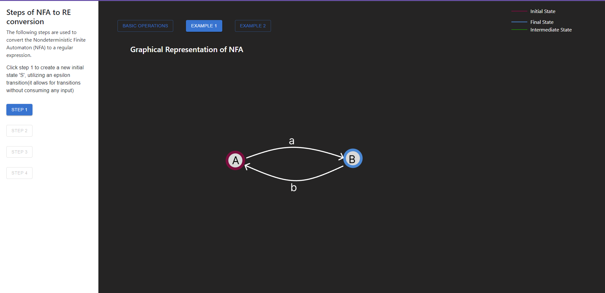
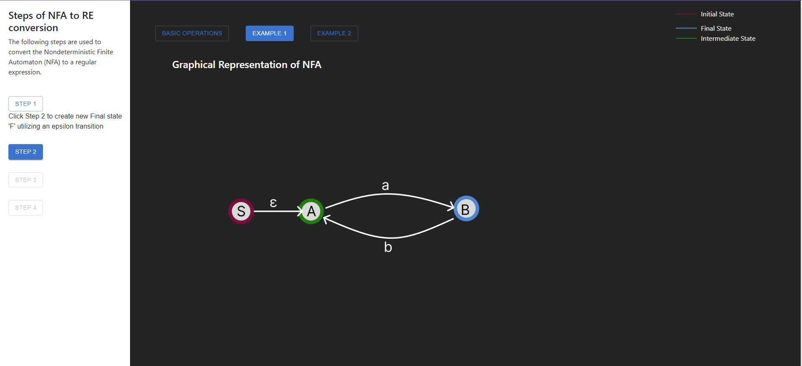
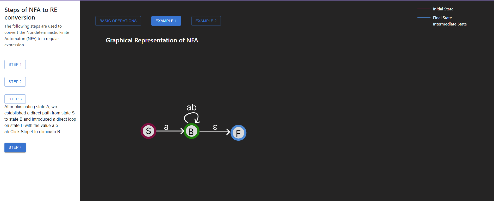
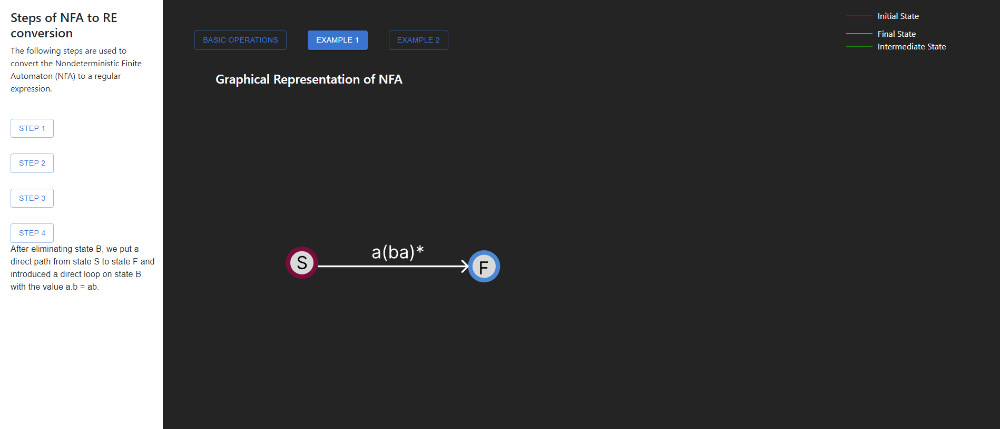

<u><h3>Procedure</u></h3>

Explore fundamental concepts by interacting with  basic operations

Upon choosing the basic operation you can explore the nfa graphical repersentation with thier corresponding regular expression  

Choose any of the examples provided to get started with simulation

Follow the instruction carefully and proceed to eliminate the intermidiate states by keeping the intial and final state

Final regular expression of the given NFA

