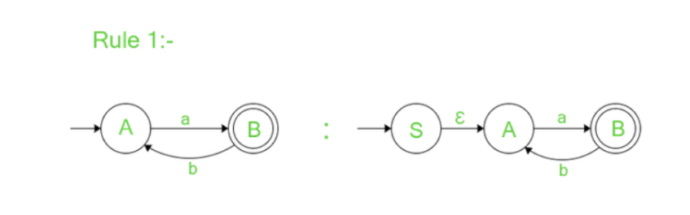
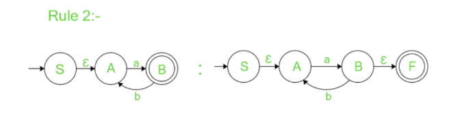
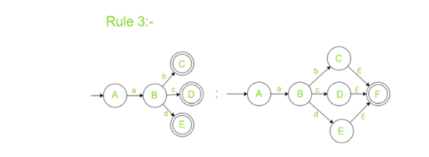

<u><h3>Theory</h3></u>
<h5>Non-Deterministic Finite Automata(NFA) </h5>

A Nondeterministic Finite Automaton (NFA) is a theoretical machine used in formal language theory to recognize regular languages. 
It is defined as a 5-tuple:
 <em>NFA = (Q, Σ, δ, q₀, F)</em>
 where:

<ul>
  <li><strong>Q</strong> is a finite set of states</li>
  <li><strong>Σ</strong> is a finite input alphabet</li>
  <li><strong>δ</strong> is the transition function: <em>δ: Q × (Σ ∪ {ε}) → 2^Q</em></li>
  <li><strong>q₀</strong> ∈ Q is the initial (start) state</li>
  <li><strong>F</strong> ⊆ Q is the set of accepting (final) states</li>
</ul>

In an NFA, the transition function allows multiple possible next states for a given input, including transitions on the empty string (ε). 
A string is accepted if at least one computation path leads from the start state to a final state while consuming the entire input.

<h5> Regular Expressions</h5>

A Regular Expression (RE)is a symbolic representation used to describe a regular language. 
It defines a set of strings over a given alphabet using specific operators and rules.

Regular expressions are built using:

<ul>
  <li><strong>Union (|):</strong> Represents a choice between expressions. For example, <em>a|b</em> matches either "a" or "b".</li>
  <li><strong>Concatenation:</strong> Represents sequences. For example, <em>ab</em> matches "a" followed by "b".</li>
  <li><strong>Kleene Star (*):</strong> Represents repetition (zero or more times). For example, <em>a*</em> matches "", "a", "aa", "aaa", etc.</li>
</ul>

A regular expression describes the same class of languages that can be recognized by finite automata. 
Thus, for every regular expression, there exists an equivalent NFA that accepts the same language, and vice versa.

In this experiment, we use the <strong>State Elimination Method</strong> to convert a given 
<strong>Nondeterministic Finite Automaton (NFA)</strong> into an equivalent 
<strong>Regular Expression (RE)</strong>. This method is widely used due to its systematic 
and intuitive approach for eliminating states and building up the corresponding expression.

<strong>State Elimination Method</strong> 

The State Elimination Method involves simplifying the NFA step-by-step by removing intermediate 
states while preserving the language accepted by the automaton. At each step, transitions between 
the remaining states are updated using regular expressions that represent the combined paths.

The process generally includes the following steps:

<strong>
Step-1:
</strong>

If there are incoming transitions to the initial state:

<li>Create a new start state with no incoming edges.</li>
<li>Add an outgoing edge from the new start state to the old start state with an ε-transition.

<li>The initial state before is now a normal state with an added incoming ε-transition.

<strong>
Step-2:
</strong>

If there are outgoing transitions from the final state:

<li>Create a new final state with no outgoing edges.</li>
<li>Add an incoming edge to the new final state from the old final state with an ε-transition.</li>
<li>The old final state is transformed into a normal state with the added transition of ε.</li>

<strong>
Step-3:
</strong>

If the automaton has multiple final states:

<li>Remove the final state  from the multiple final states.</li>
<li>Add outgoing ε-transitions from the multiple final states to a new and only final state with no outgoing transitions.</li>

<strong>
Step-4:
</strong>
Eliminate all the states one by one except initial state and final state to get the final result which is the regular expression for the given NFA 
