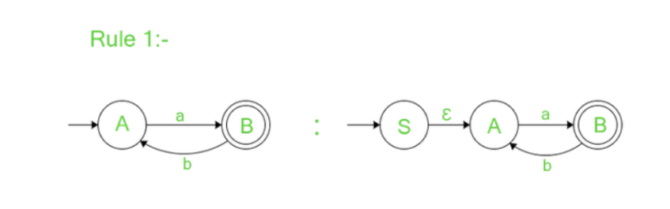
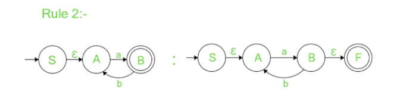
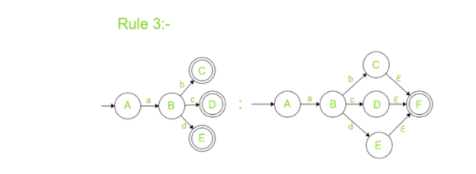

<u><h3>Theory</h3></u>
<h5>Non-Deterministic Finite Automata(NFA) </h5>

NFA (Non-Deterministic Finite Automata) is a state machine used to validate an input string using state transitions. In NFA, multiple paths can exist from the current state to the next state for an input symbol.

<h5> Regular Expressions</h5>

Regular expressions are a sequence of characters that are used to check if the given string follows the pattern or not.

There are two main methods for converting a given NFA to a regular expression:

1. State Elimination Method

2. Arden's Theorem Method

<h6><u>State elimination Method </u></h6>

Step -1

If there are incoming transitions to the initial state:

<li>Create a new start state with no incoming edges.</li>
<li>Add an outgoing edge from the new start state to the old start state with an ε-transition.

<li>The initial state before is now a normal state with an added incoming ε-transition.c

Step-2:

If there are outgoing transitions from the final state:

<li>Create a new final state with no outgoing edges.</li>
<li>Add an incoming edge to the new final state from the old final state with an ε-transition.</li>
<li>The old final state is transformed into a normal state with the added transition of ε.</li>

Step-3:

If the automaton has multiple final states:

<li>Remove the final state status from the multiple final states.</li>
<li>Add outgoing ε-transitions from the multiple final states to a new and only final state with no outgoing transitions.</li>

Step-4:

Eliminate all the states one by one except initial state and final state to get the final result which is the regular expression for the given NFA 
